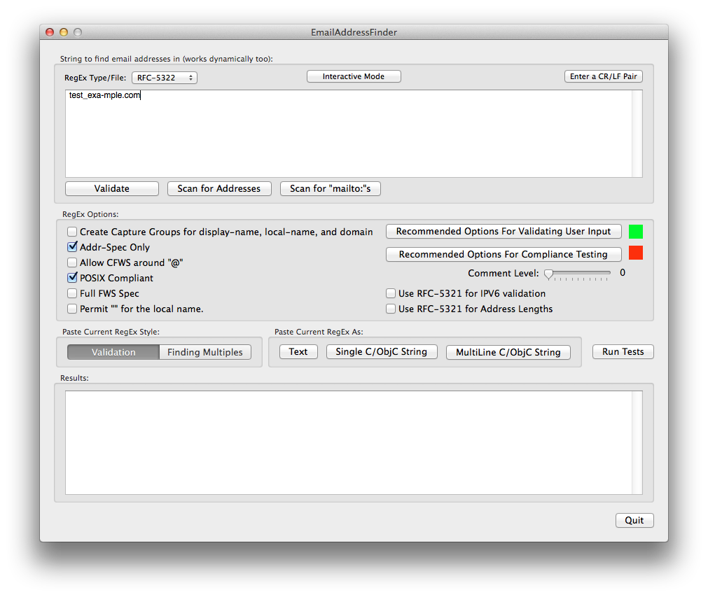

EmailAddressFinder
==================

Updates:
  4/18/2013:  add a mailto parser, which will be much faster and thorough if thats all you need.
  
Objective-C Class (for both iOS and OSX) to:

- find email addresses embedded within arbitrary strings

- find "mailto" objects and return each as a dictionary with to, cc, bcc, subject, and body tags

- test if a string is a syntactically correct email address

USAGE: 

Run the code, and enter a string with (or without) one or more email addresses in it. Play around with the string, and keep testing.

DESIGN:

For "mailto: tag searches, uses NSScanner to return an array of dictionaries, each dictionary representing a single mailto item with all tagged values.

For brute force searches, uses regular expressions to return an array of dictionaries, each one containing one to three strings. If the address in the "Mailbox" style, the three strings represent the name, address, and full mailbox specifier. If the string is a simple address, the dictionary only contains the key "address".

An email address is the familiar **fred@mac.com** and a **mailbox specifier** is of the form **"Fred Smith" <fred@mac.com>**. Also, addresses in the form "mailto:so@so.com" are properly recognized.

RFC5322 defines both email addresses and "mailbox specifiers" in section 3.4. "Address Specification". Mailbox information is returned in a dictionary with three items in each: the "name" (quotes preserved), the "address" (minus angle brackets), and the whole thing as it appeared in the string.

References:

- Relevant RFCs: http://code.iamcal.com/php/rfc822/
- RFC3696, "mailto:" specified (section 4.3):  http://tools.ietf.org/html/rfc3696 and errat: http://www.rfc-editor.org/errata_search.php?rfc=3696
- RFCrfc6068 "mailto: format:  http://tools.ietf.org/html/rfc6068

- Email Address Evaluation Blog: http://isemail.info/about
- Comparison of various algoritms (and where I got two of the Regex's here): http://fightingforalostcause.net/misc/2006/compare-email-regex.php
- What the PHP suffix means (e.g., "/searchString/suffix"): http://www.php.net/manual/en/reference.pcre.pattern.modifiers.php

Ratings from http://isemail.info/about on 3/21/2013

Regex1 source: http://svn.php.net/viewvc/php/php-src/trunk/ext/filter/logical_filters.c?view=markup and ranked #1 
Regex2 source: http://jgotti.net/ and ranked #2 now (but known problem with Mailbox format, i.e., <a@b.com>, and multiple addresses)

Copyright (c) 2013 by David Hoerl